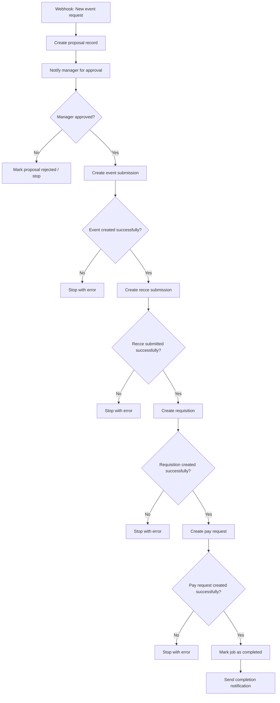

# n8n workflow for event lifecycle

This workflow handles the full event journey from proposal submission to job completion, with strict sequencing:

- Proposal creation is blocked until the manager approves it.
- Each later step only runs if the previous step completed successfully.
- The job is marked complete only after the pay request has been created and the final confirmation is received.

## Flow overview



## Suggested n8n node sequence

1. Webhook
   - Trigger from the app or a form submission.
   - Use the production URL: `https://kenmongare.app.n8n.cloud/webhook/event-lifecycle`
   - Expected payload:
     - proposal details
     - event details
     - client
     - requested by
     - budget

2. Set / Merge
   - Initialize workflow state:
     - proposal_status = pending_manager_approval
     - event_status = pending
     - recce_status = pending
     - requisition_status = pending
     - pay_request_status = pending

3. Google Sheets node
   - Append a proposal row to a Google Sheet for tracking.
   - Save fields such as:
     - title
     - budget
     - submitted_by
     - submitted_at
     - status = pending

4. Email / Slack / Notification node
   - Send approval request to the manager.
   - Include proposal title, budget, and submitter.

5. Wait node or approval webhook
   - Pause the workflow until the manager approves or rejects the proposal.
   - This is the critical dependency gate.

6. IF node: Manager approved?
   - If no, update proposal to rejected and stop.
   - If yes, update proposal to approved and continue.

7. HTTP Request node
   - Send the approved payload to the Google Apps Script web app as an event submission.
   - Payload type: event_submission.

8. IF node: Event created successfully?
   - Only continue if the event submission response is success.

9. HTTP Request node
   - Send recce payload to the Google Apps Script web app.
   - Payload type: recce.

10. IF node: Recce submitted successfully?
    - Only continue if recce creation succeeded.

11. HTTP Request node
    - Send requisition payload.
    - Payload type: requisition.

12. IF node: Requisition created successfully?
    - Only continue if requisition creation succeeded.

13. HTTP Request node
    - Send pay request payload.
    - Payload type: pay_request.

14. IF node: Pay request created successfully?
    - Only continue if this succeeded.

15. Update / Finalize node
    - Mark the job as completed.
    - Update related proposal/event status.
    - Send a completion notification.

## Important dependency rules

- Proposal approval must happen before any event creation.
- Event creation must succeed before recce can be created.
- Recce submission must succeed before requisition can be created.
- Requisition must succeed before pay request can be created.
- Pay request must succeed before the job is marked complete.

## Example payload flow

### 1) Proposal payload

```json
{
  "type": "proposal",
  "payload": {
    "title": "Annual Gala",
    "budget": 25000,
    "submitted_by": "agent@example.com",
    "submitted_at": "2026-06-29T10:00:00.000Z"
  }
}
```

### 2) Event payload

```json
{
  "type": "event_submission",
  "payload": {
    "job_id": "JOB-1001",
    "description": "Annual Gala",
    "client": "Client A",
    "status": "planning",
    "clientLead": "Jane",
    "projectLead": "John",
    "email": "agent@example.com",
    "where": "Nairobi",
    "startDate": "2026-07-10",
    "endDate": "2026-07-12"
  }
}
```

### 3) Recce payload

```json
{
  "type": "recce",
  "payload": {
    "job_id": "JOB-1001",
    "email": "agent@example.com",
    "client": "Client A",
    "description": "Annual Gala",
    "reccee_date": "2026-07-01",
    "location": "Nairobi",
    "company": "Event Portal"
  }
}
```

### 4) Requisition payload

```json
{
  "type": "requisition",
  "payload": {
    "job_id": "JOB-1001",
    "client": "Client A",
    "company": "Event Portal",
    "event_description": "Annual Gala",
    "requestor_name": "Agent Name",
    "requestor_email": "agent@example.com",
    "date_required": "2026-07-05",
    "total_amount": 12000,
    "urgency": "High"
  }
}
```

### 5) Pay request payload

```json
{
  "type": "pay_request",
  "request": {
    "id": "PR-001",
    "event": "JOB-1001",
    "vendor": "Supplier X",
    "amount": 12000,
    "status": "pending",
    "date": "2026-07-05",
    "category": "Logistics"
  }
}
```

## Recommended n8n implementation notes

- Use a Webhook trigger for the starting event.
- Use a Wait node for the manager approval step.
- Use IF nodes for every dependency gate.
- Use the existing Apps Script web app as the data sink for events, recce, requisition, and pay requests.
- Store the workflow state in Google Sheets so you can track progress and resume if needed.
